# Benchmark Results

## Titan X (Pascal)

* GPU: Titan X (Pascal)
* CPU: Intel(R) Xeon(R) CPU E5-2630 v4 @ 2.20GHz
* OS: Ubuntu 16.04 LTS
* Nvidia Driver: 375.26
* CUDA: 8.0.61
* CUDNN: 5.1.5

### **AlexNet**

### **VGG16**

### **VGG19**

### **Inception-V3**

### **ResNet50**

**### ResNet101**

### **ResNet152**

## GeForce GTX 1080

* GPU: GeForce GTX 1080
* CPU: Intel(R) Xeon(R) CPU E5-2620 v4 @ 2.10GHz
* OS: Ubuntu 16.04 LTS
* Nvidia Driver: 367.35
* CUDA: 8.0.27
* CUDNN: 5.1.5

### **AlexNet**
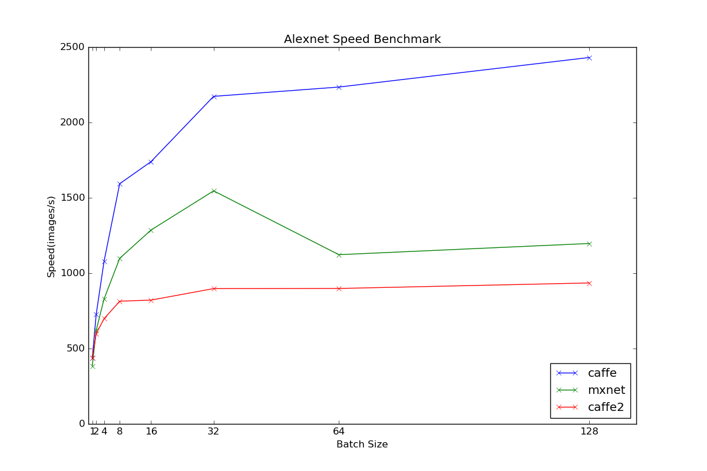
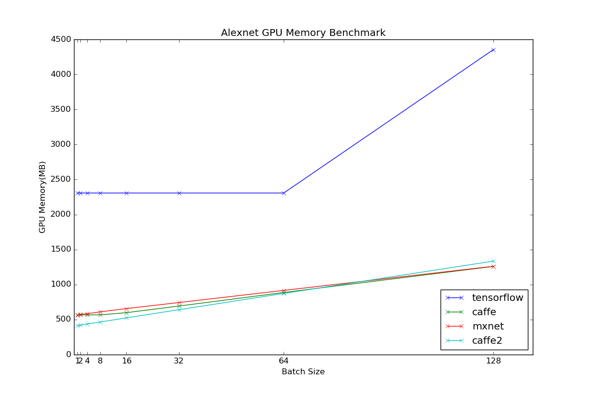

### **VGG16**
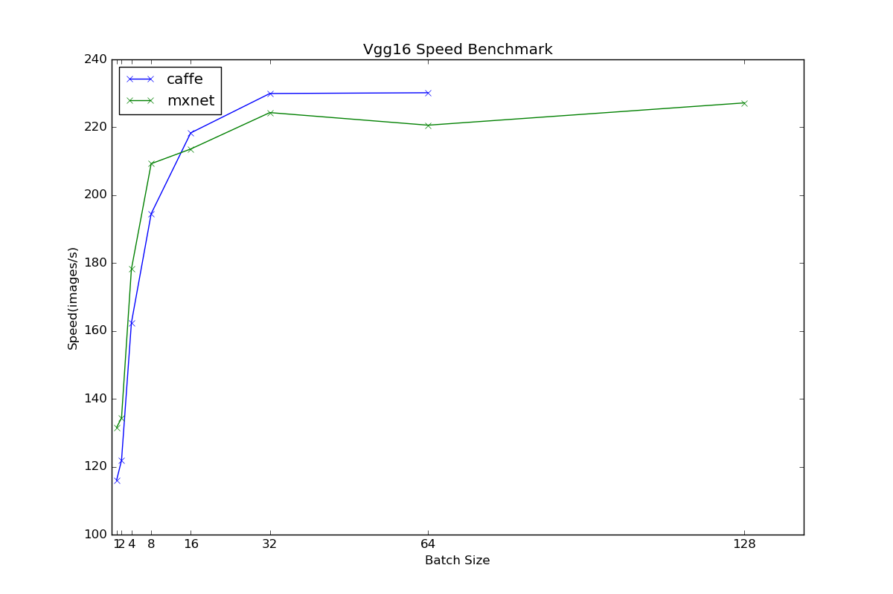
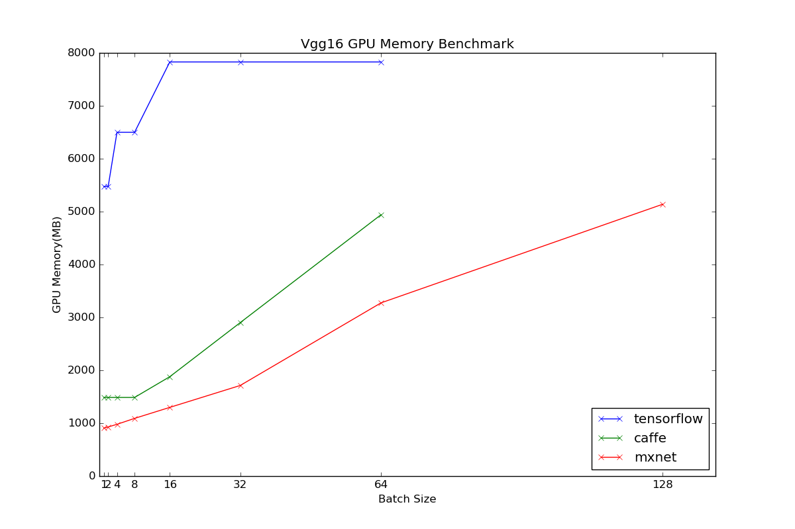

### **VGG19**
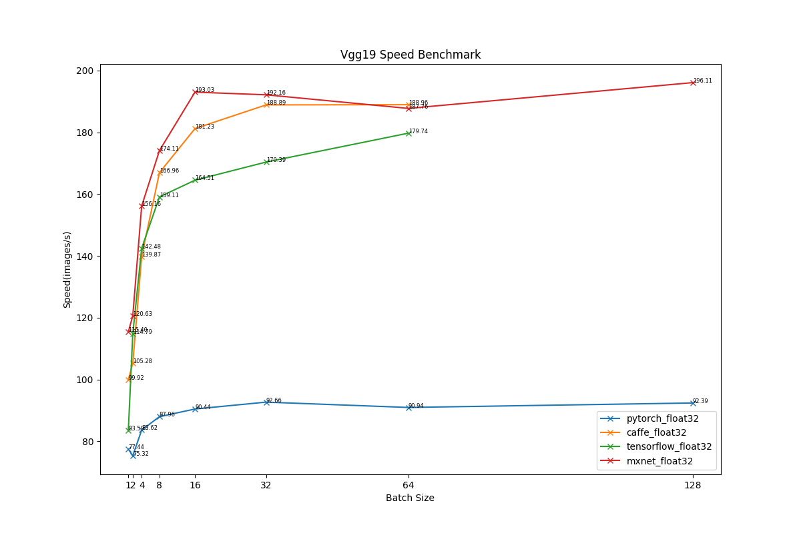
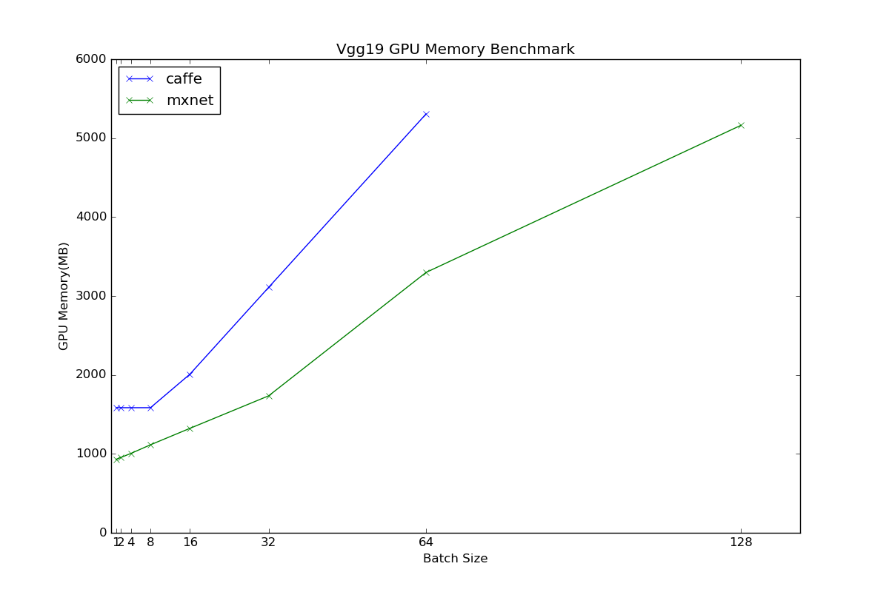

### **Inception-V3**
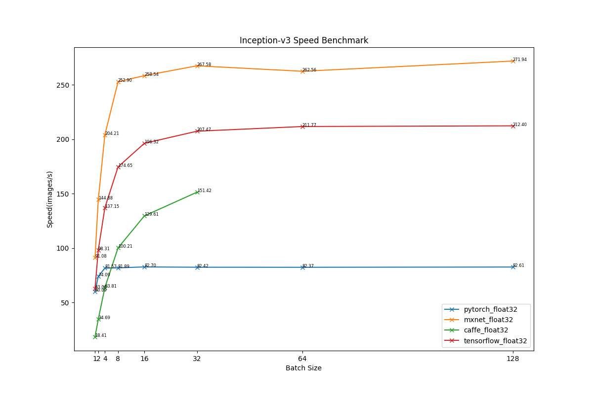
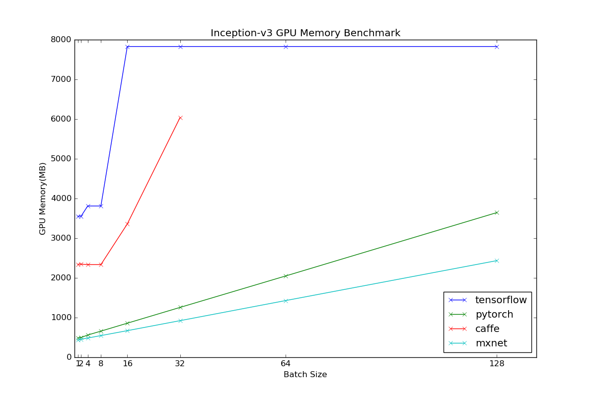

### **ResNet50**
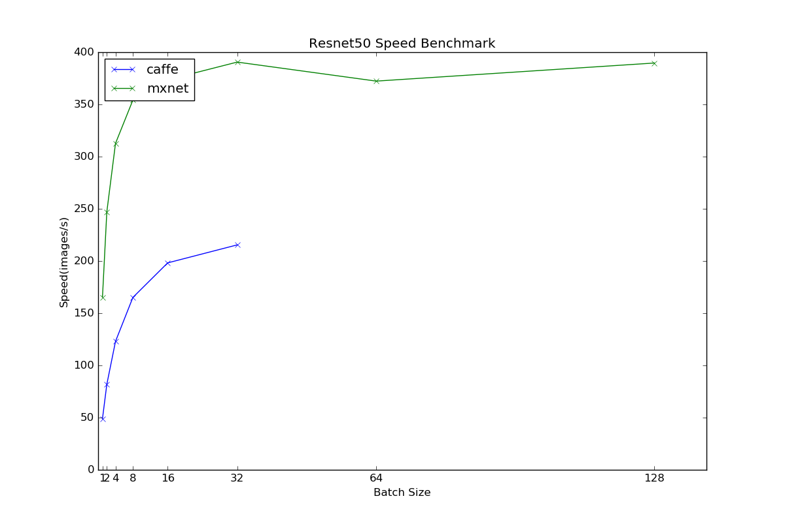
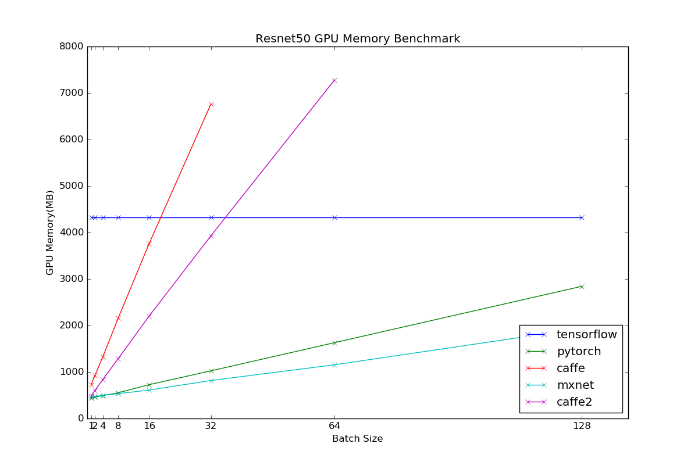

### **ResNet101**

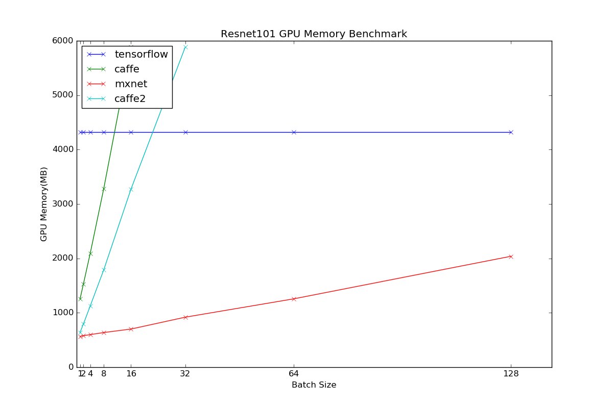

### **ResNet152**
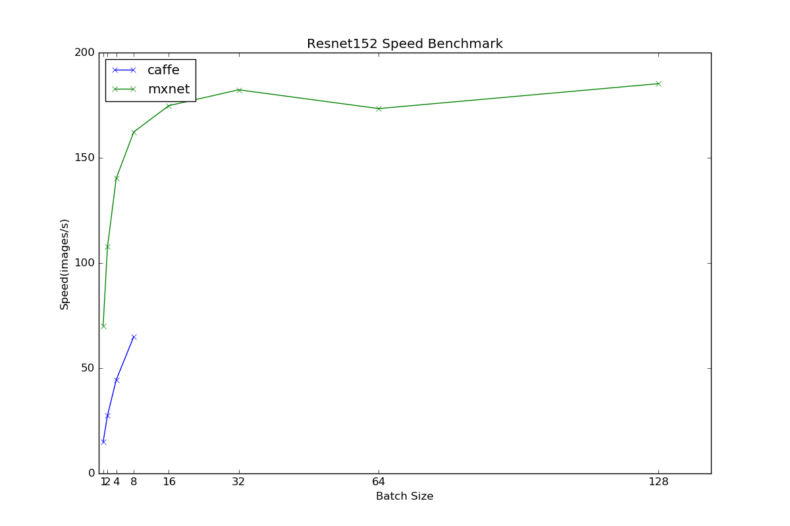
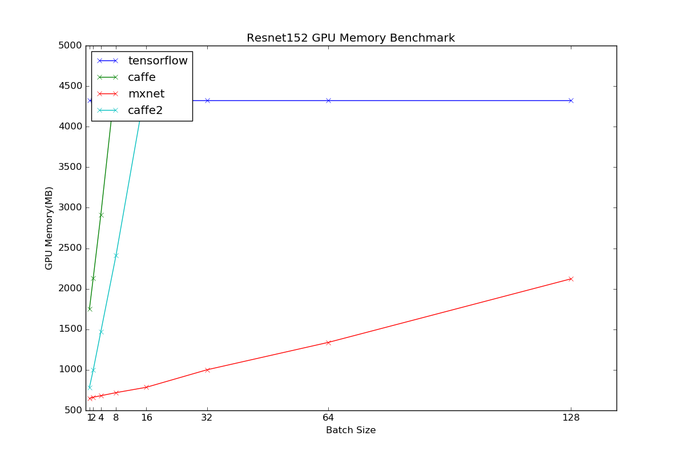
