# Benchmark Results of GeForce GTX 1080 Ti

* GPU: GeForce GTX 1080 Ti
* CPU: Intel(R) Core(TM) i7-7700K CPU @ 4.20GHz
* OS: Ubuntu 16.04 LTS
* Nvidia Driver: 381.22
* CUDA: 8.0.61
* CUDNN: 5.1.10
* Caffe GitHub hash: [7640f04](https://github.com/BVLC/caffe/commit/4efdf7ee49cffefdd7ea099c00dc5ea327640f04)
* Caffe2 GitHub hash: [7ca38fc](https://github.com/caffe2/caffe2/commit/882694d16644386cbb8e1b7418ab122467ca38fc)
* MXNet GitHub hash: [5e9b5e6](https://github.com/dmlc/mxnet/commit/bd5df7ce0f52065ed813cc6b97e94e0f75e9b5e6)
* PyTorch version: 0.1.12_2
* Tensorflow version: 1.2.1

## AlexNet
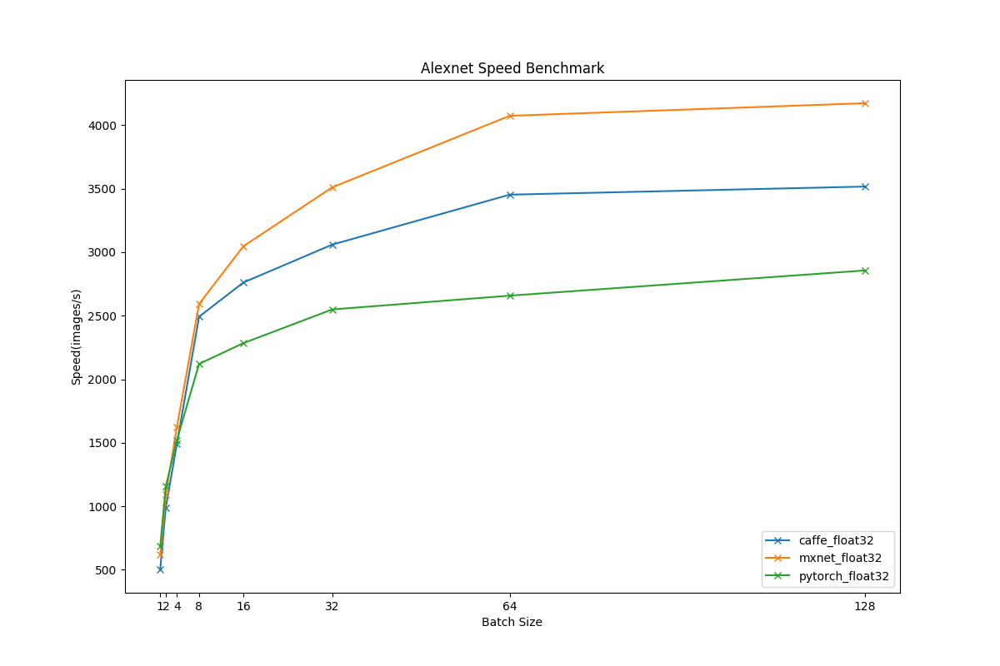
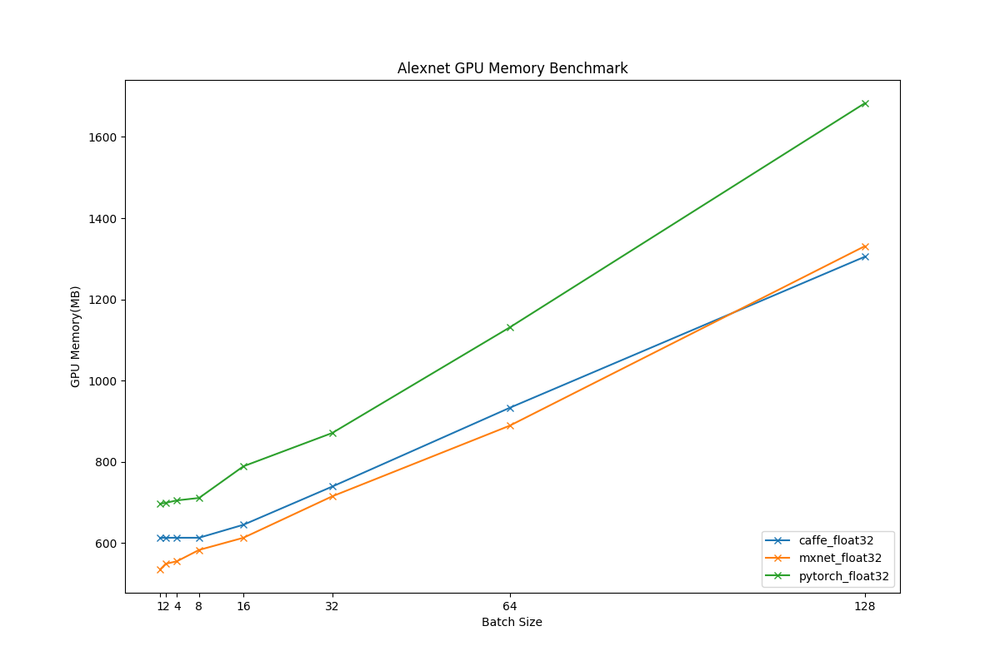

## VGG16
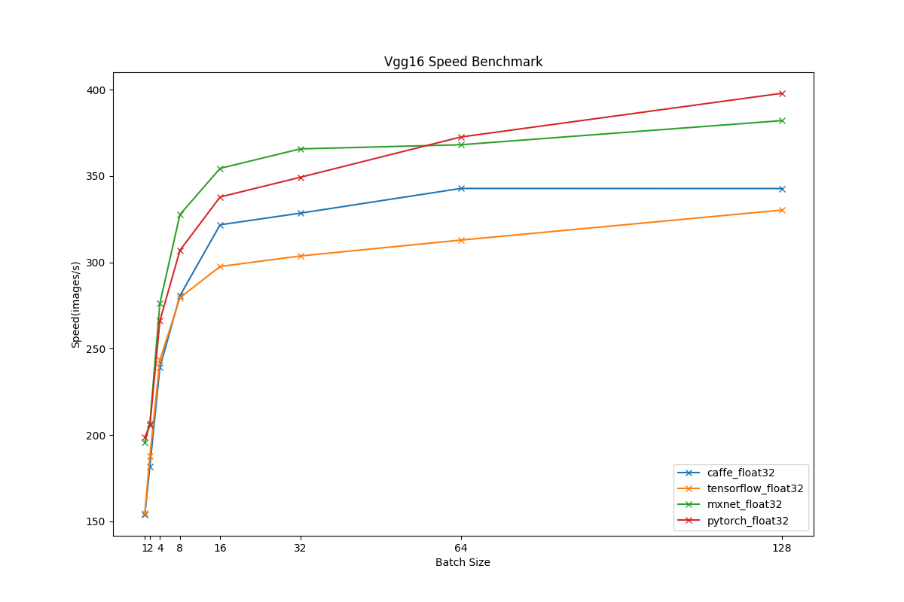
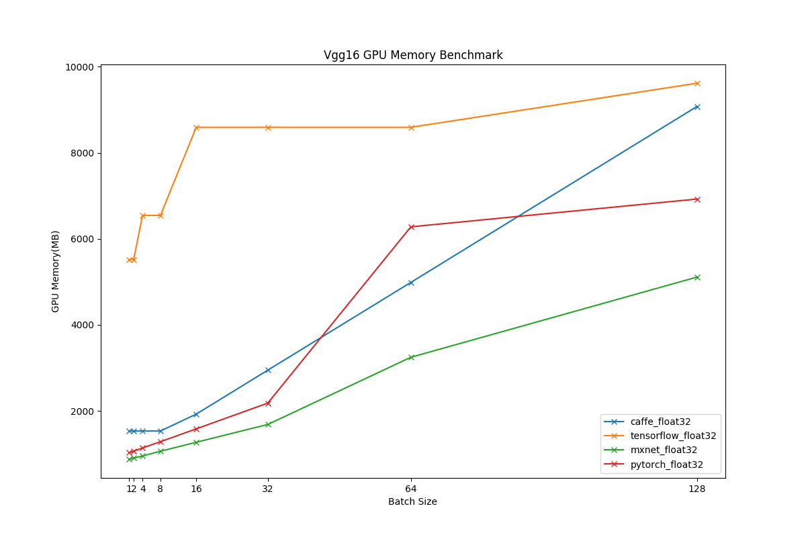

## VGG19

## Inception-BN
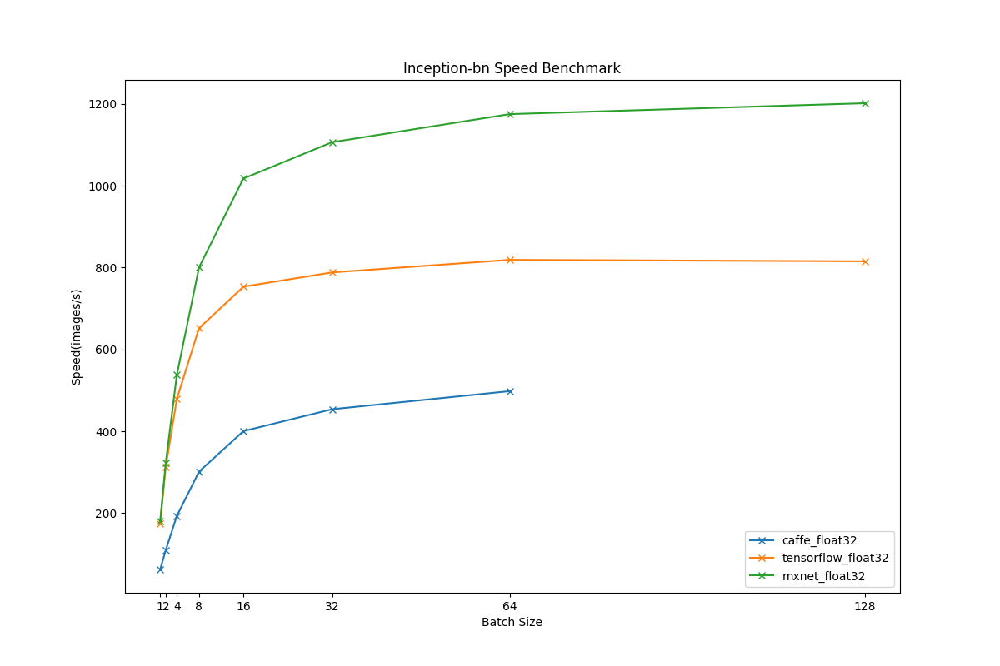

## Inception-V3
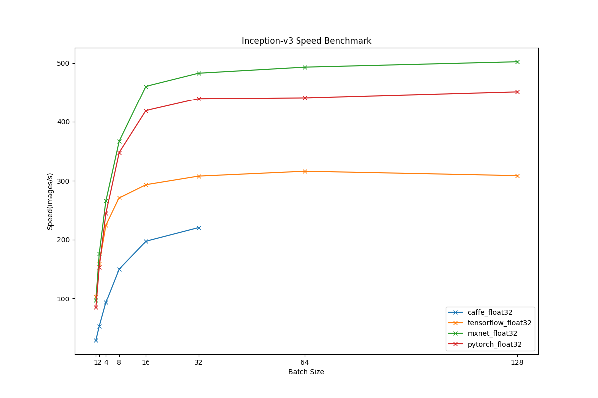
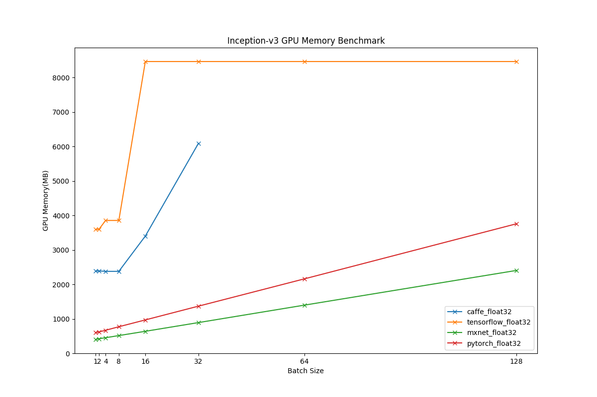

## ResNet50

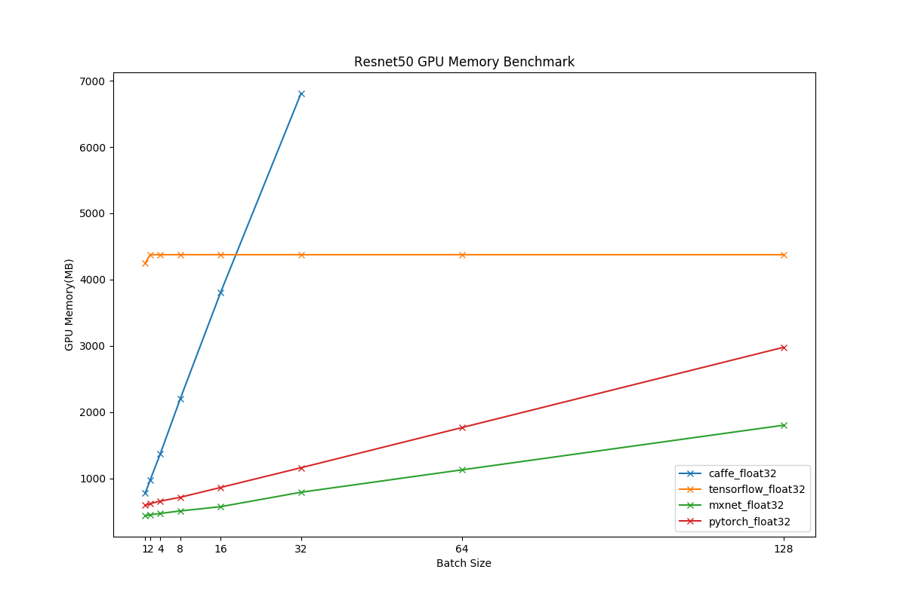

## ResNet101
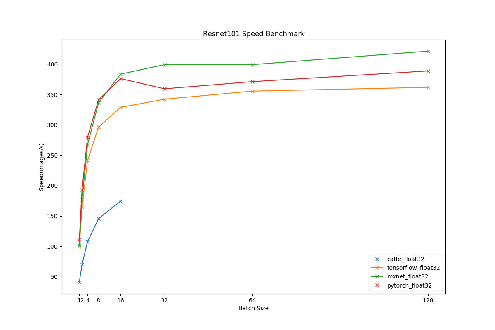
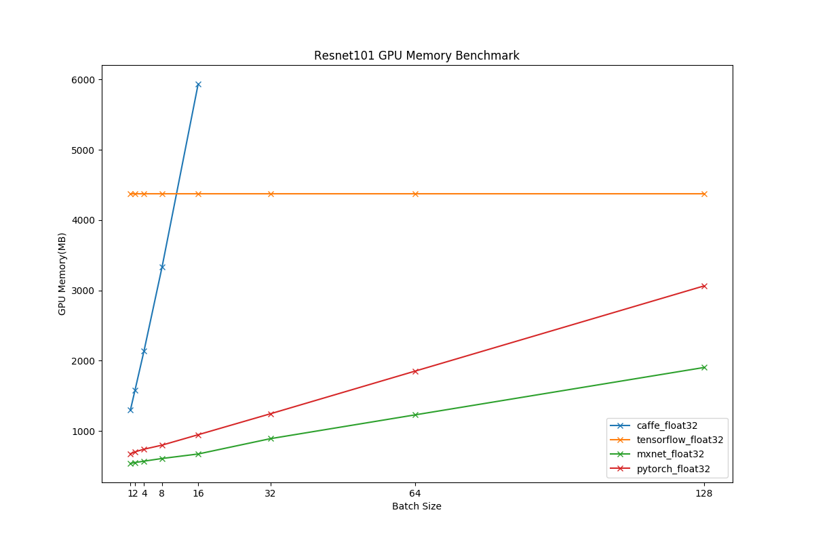

## ResNet152
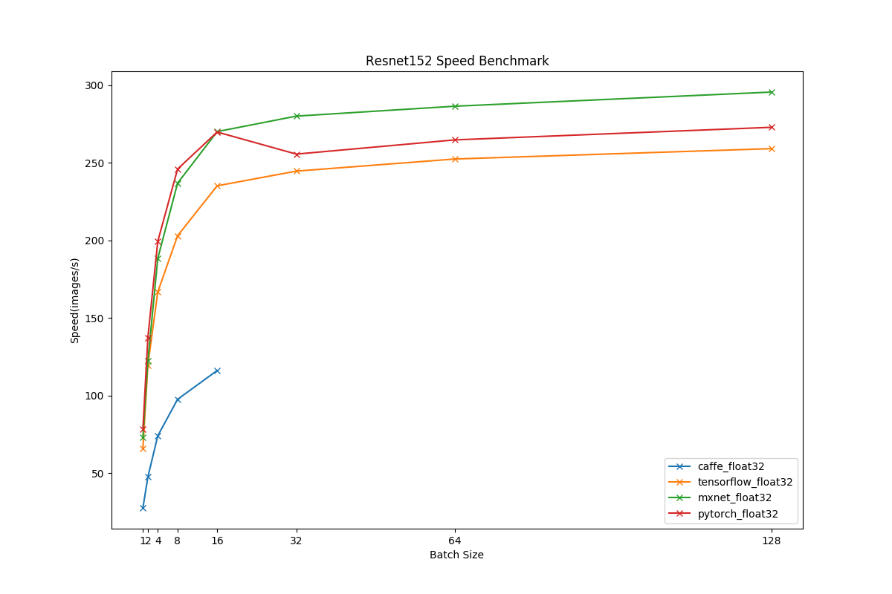
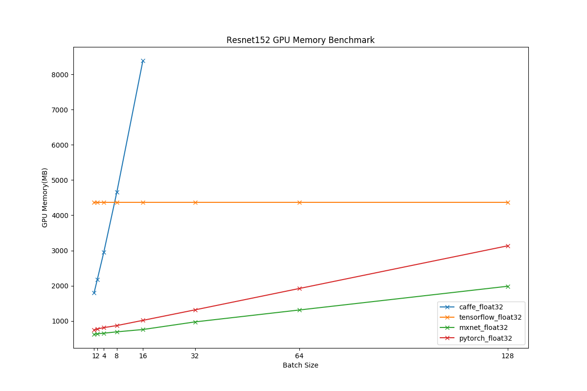
