# Benchmark Results of RTX2080Ti

* GPU: RTX2080Ti
* CPU: Intel(R) Xeon(R) CPU E5-2690 v4 @ 2.60GHz
* OS: Ubuntu 16.04 LTS
* Nvidia Driver: 418.74
* CUDA: 10.0.130
* CUDNN: 7.5.1
* MXNet Version: 1.4.0.post0
* PyTorch version: 1.1.0

## AlexNet
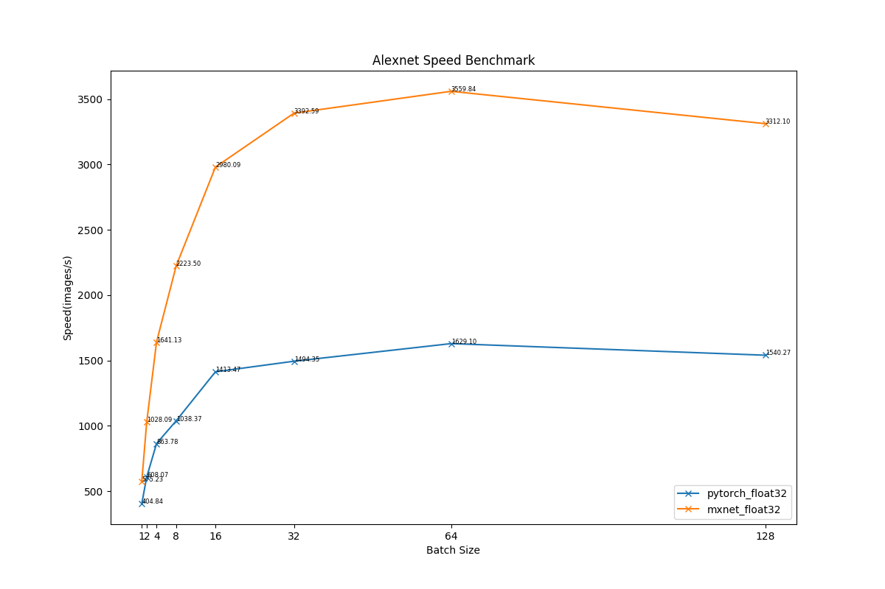

## VGG16
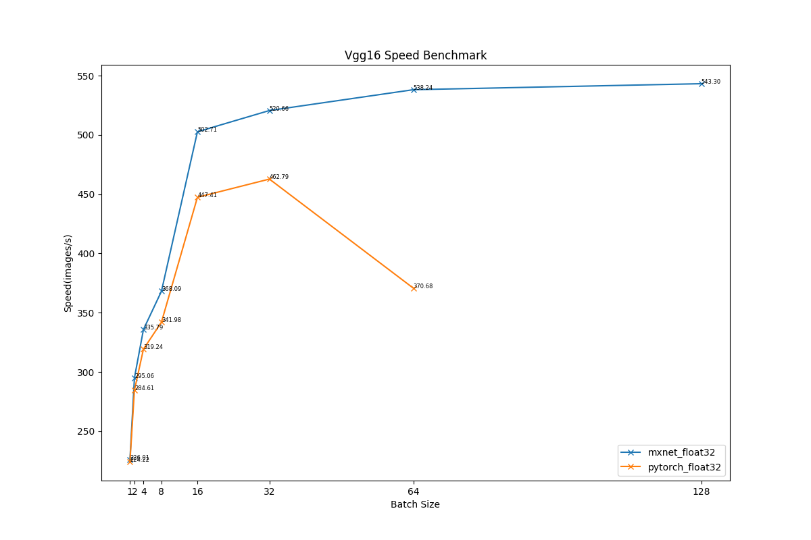
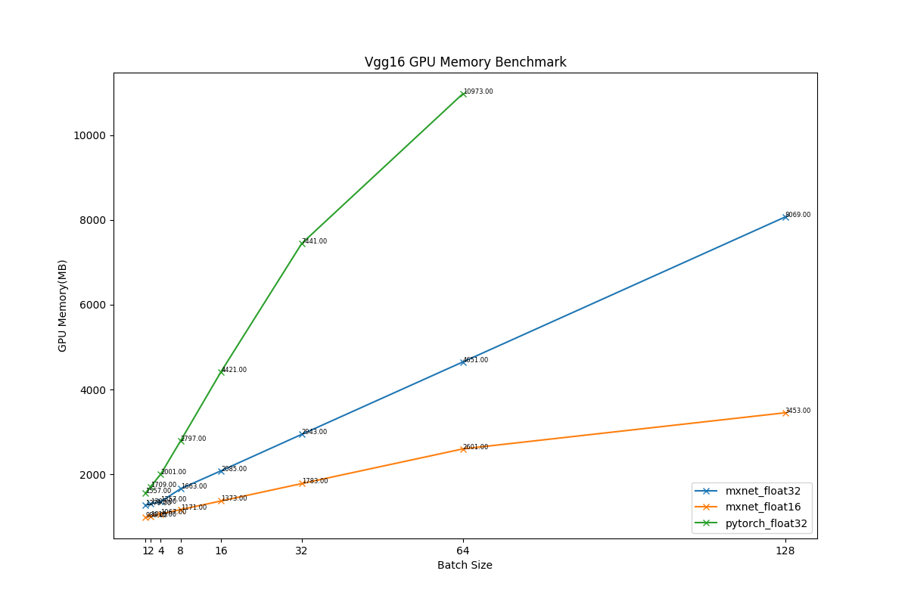

## VGG19
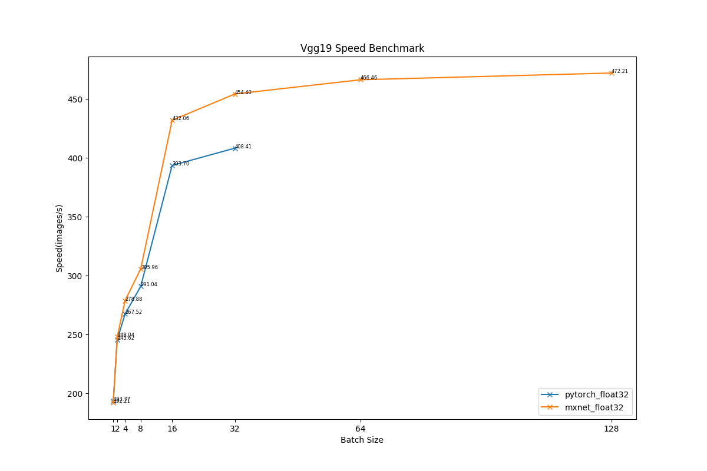
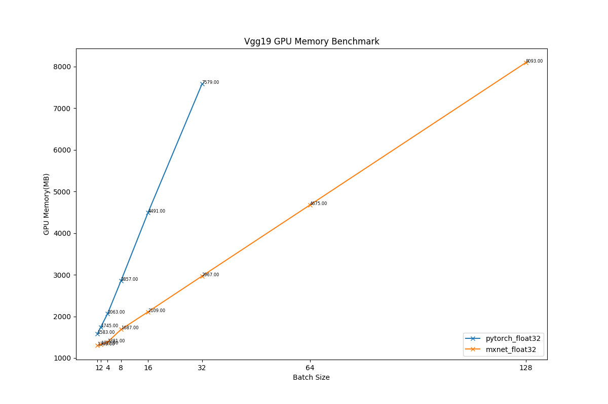

## Inception-BN
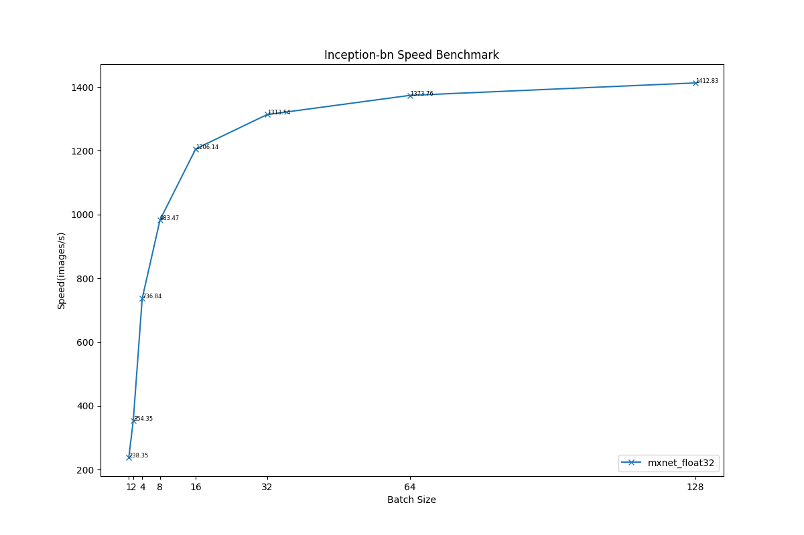
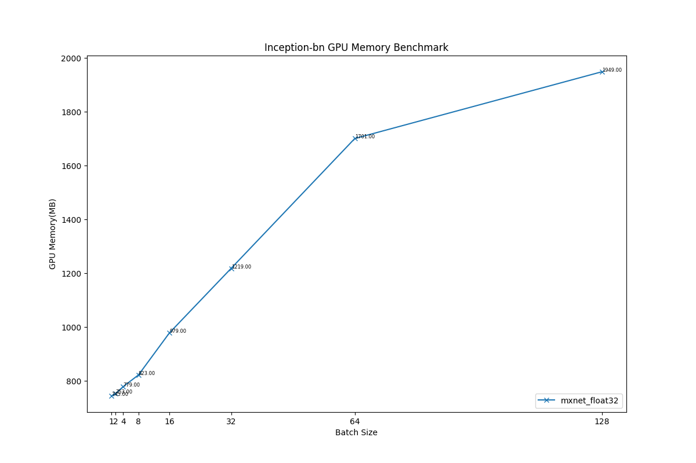

## Inception-V3

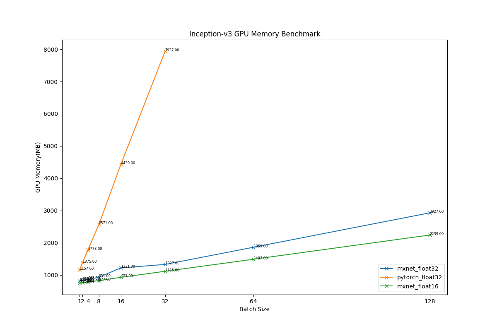

## ResNet50
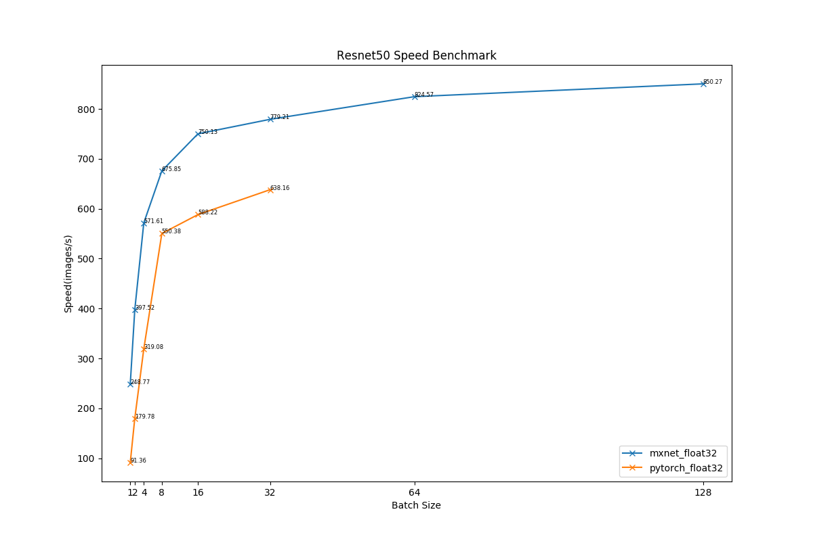
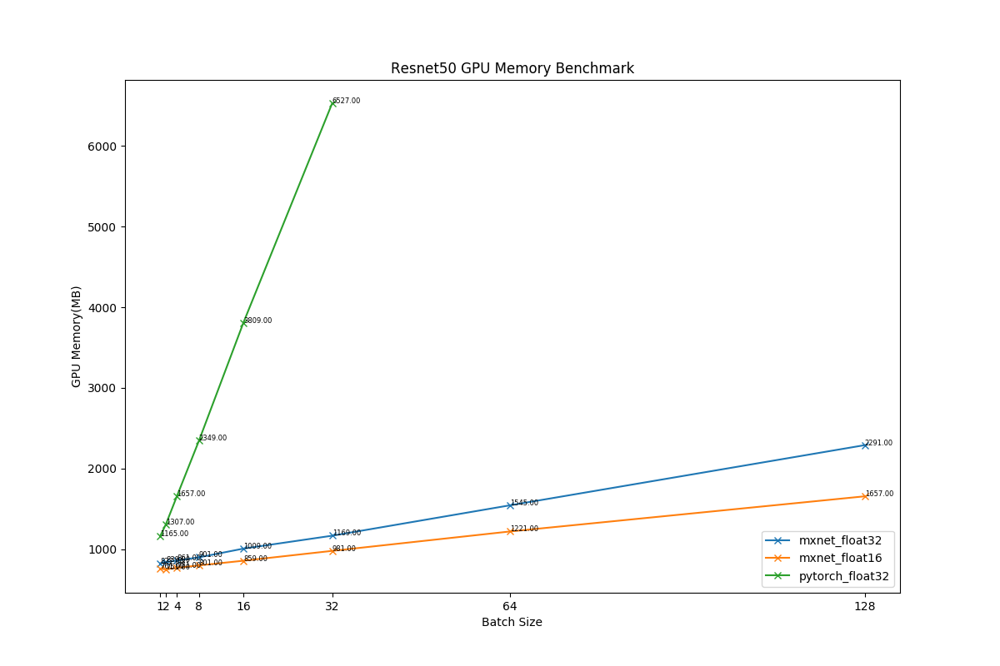

## ResNet101
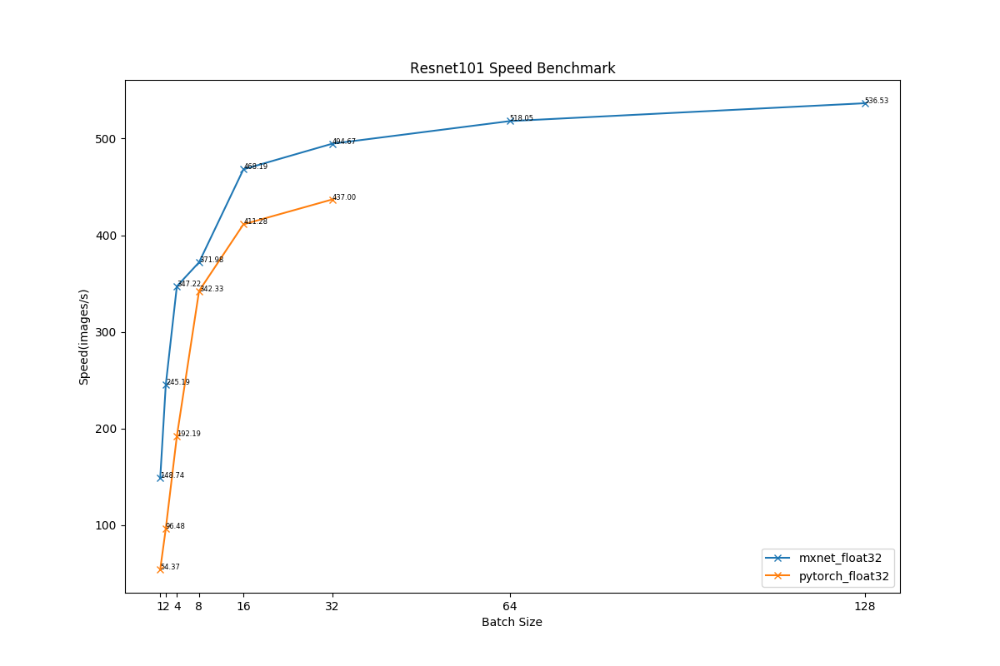
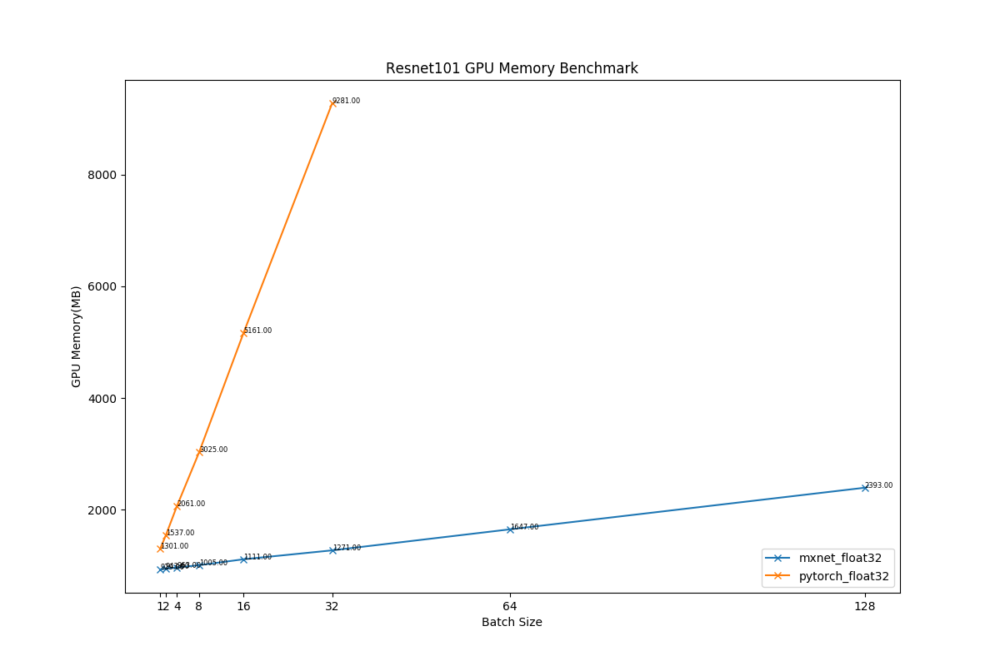

## ResNet152
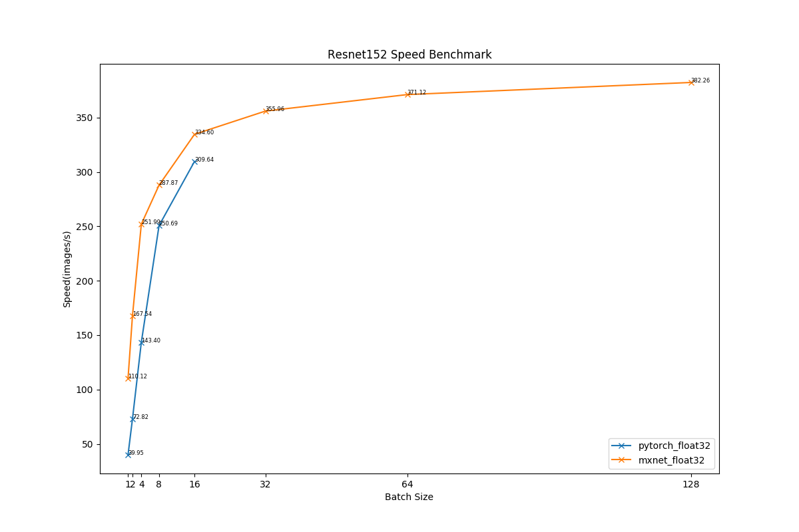
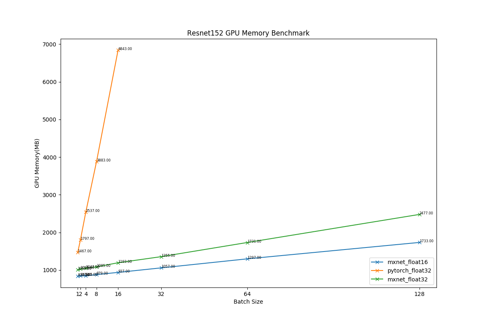
