# Benchmark Results of Tesla V100

* GPU: Tesla V100-PCIE
* CPU: Virtual Senior CPU
* OS: Ubuntu 16.04 LTS
* Nvidia Driver: 390.46
* CUDA: 9.1.85
* CUDNN: 7.1.3
* Caffe GitHub commit: [cd88ec9](https://github.com/BVLC/caffe/commit/864520713a4c5ffae7382ced5d34e4cadc608473)
* MXNet Version: 1.1.0
* PyTorch version: 0.4.0
* Tensorflow version: 1.8.0

## AlexNet
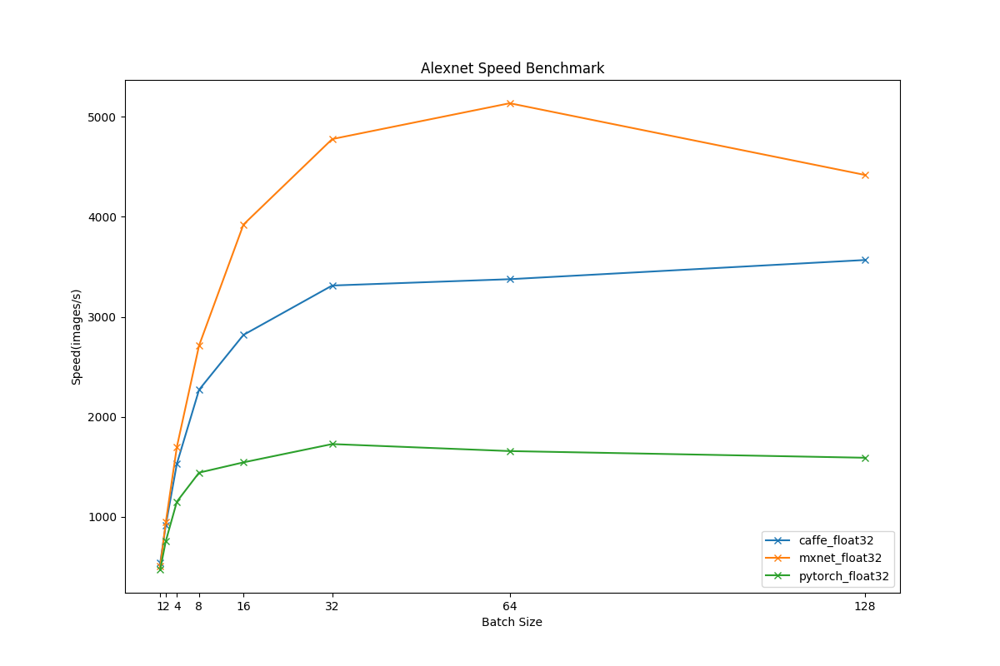
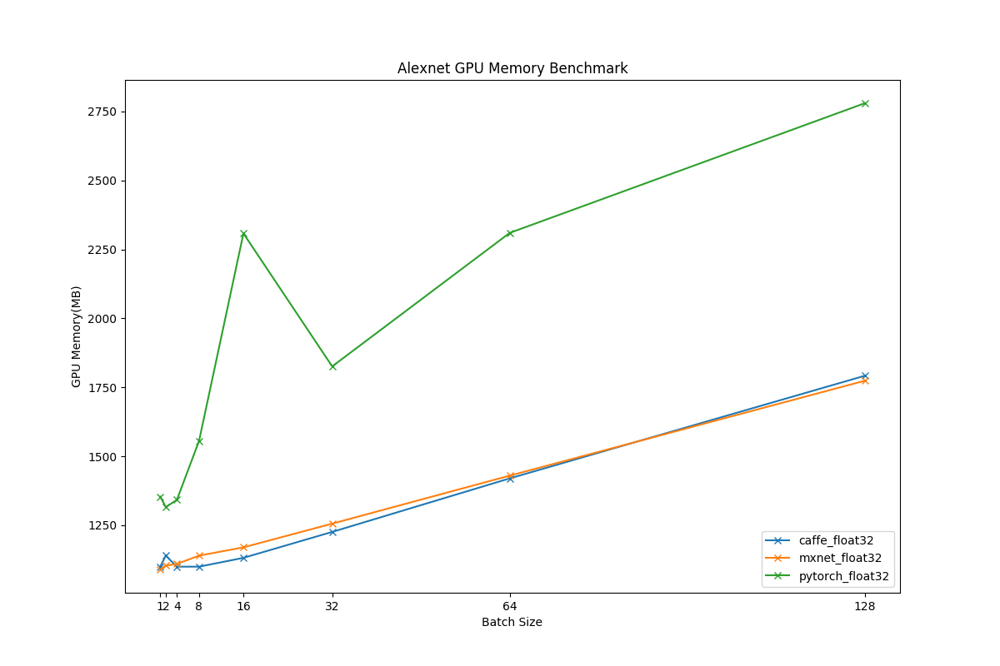

## VGG16
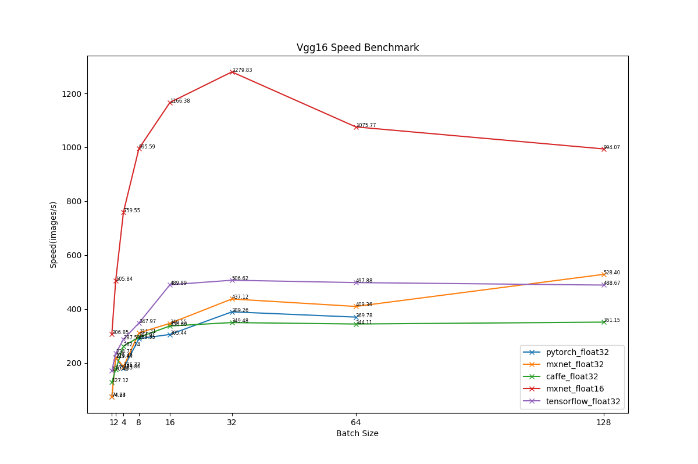
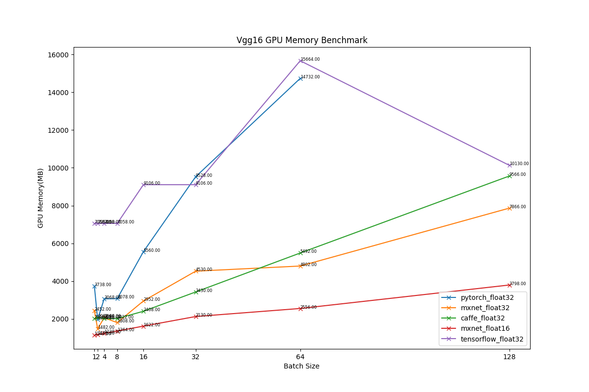

## VGG19
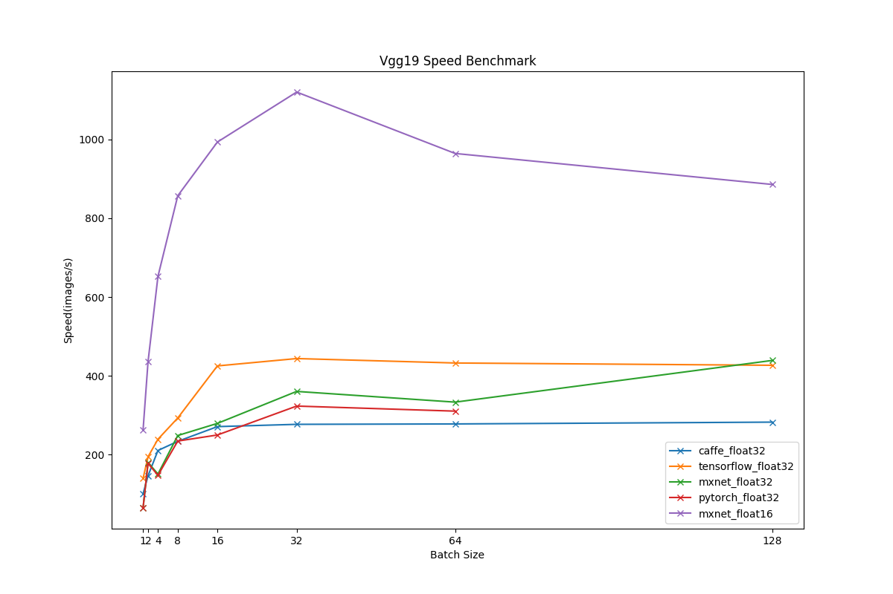
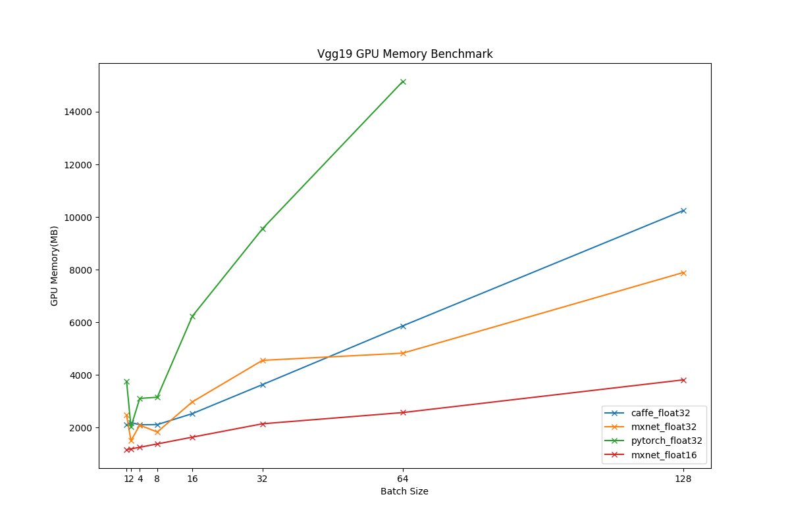

## Inception-BN
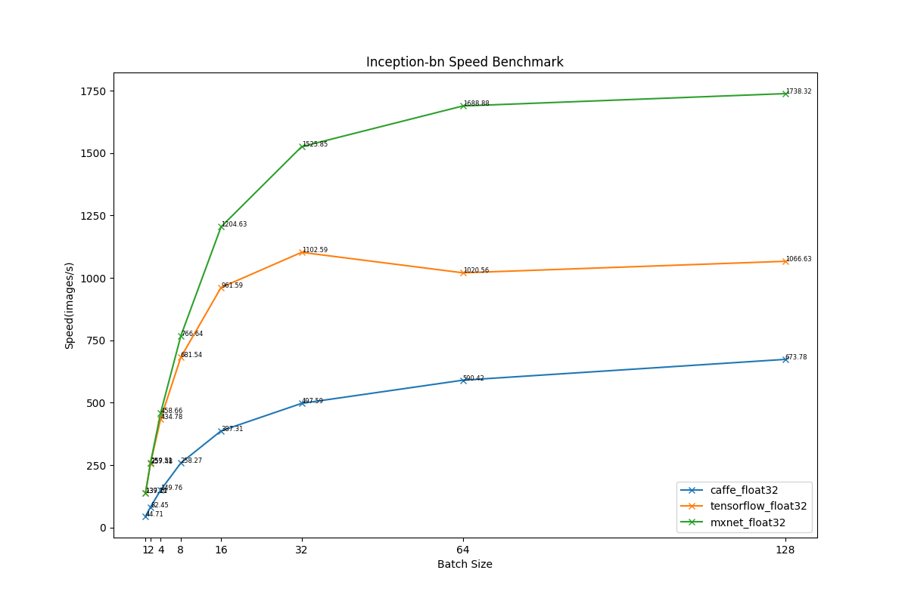

## Inception-V3
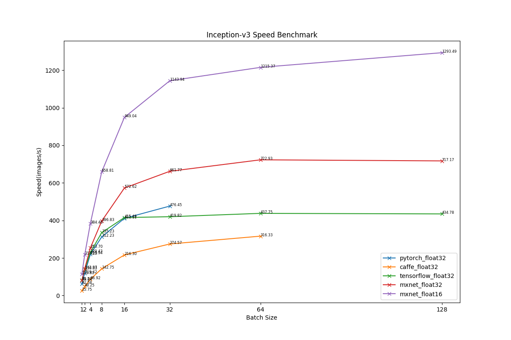
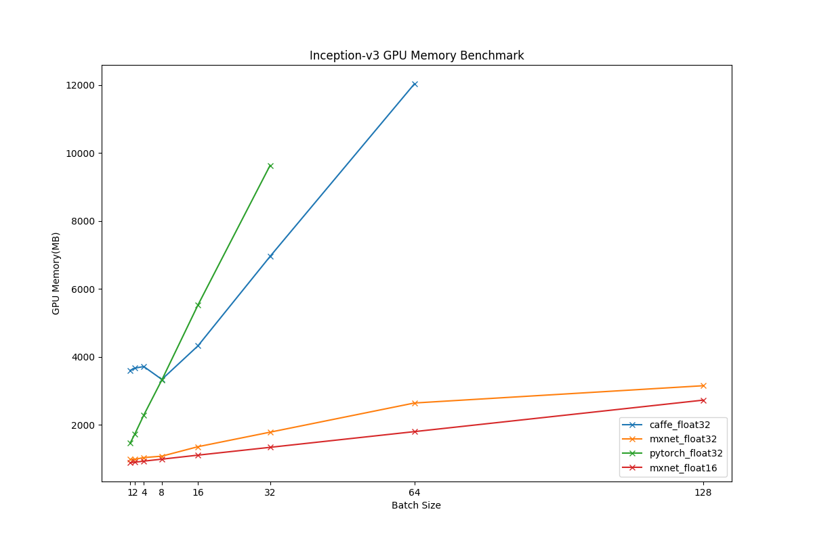

## ResNet50
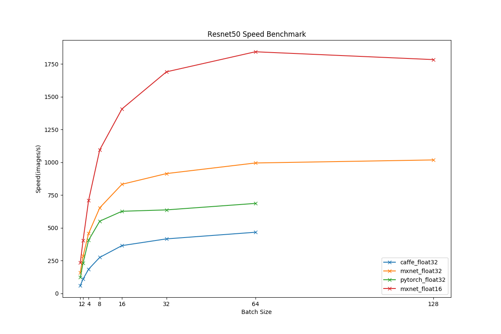

## ResNet101
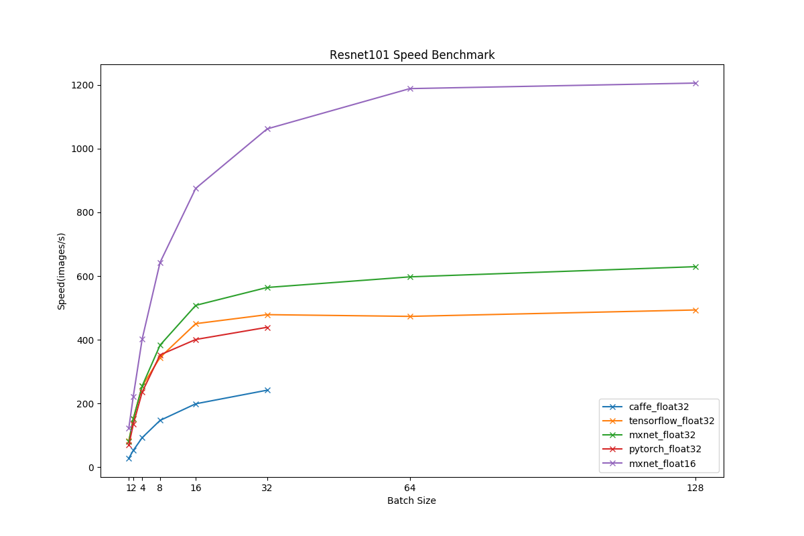
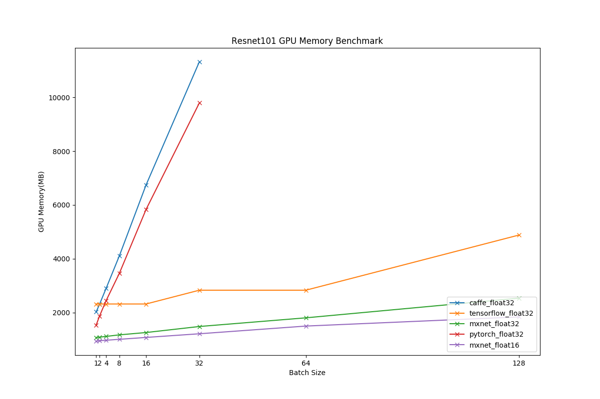

## ResNet152
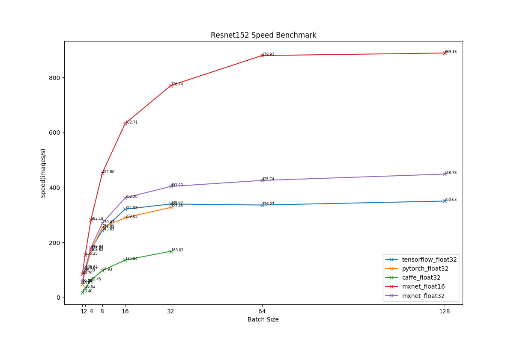
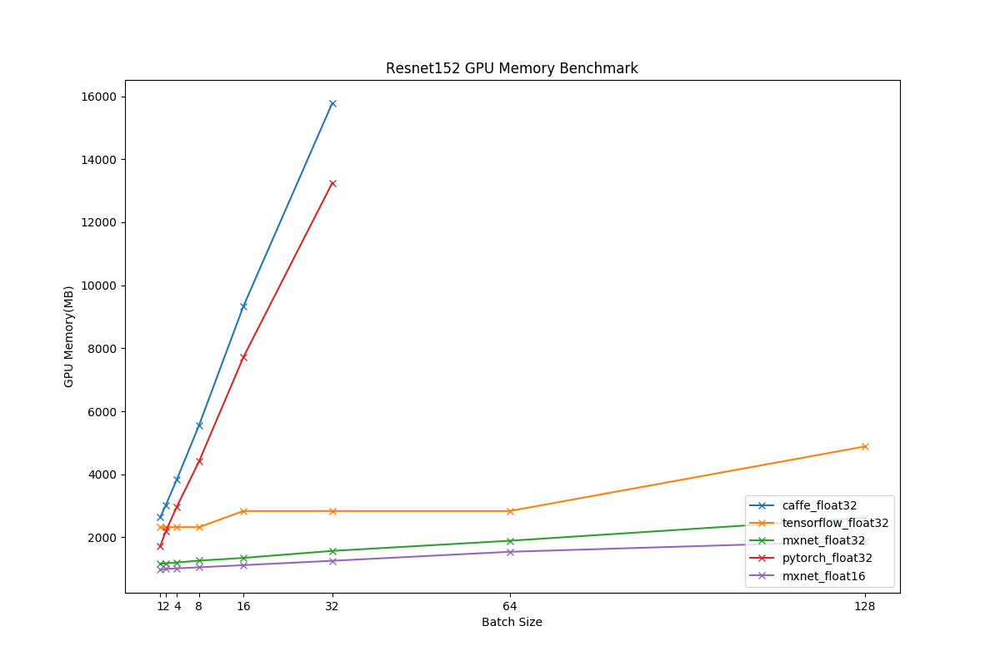

