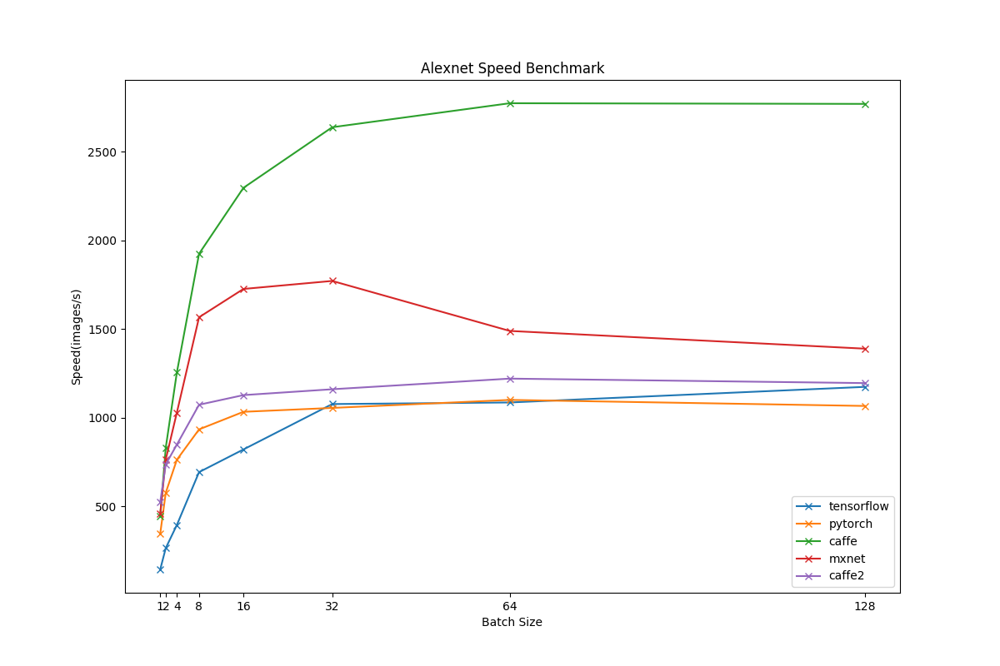
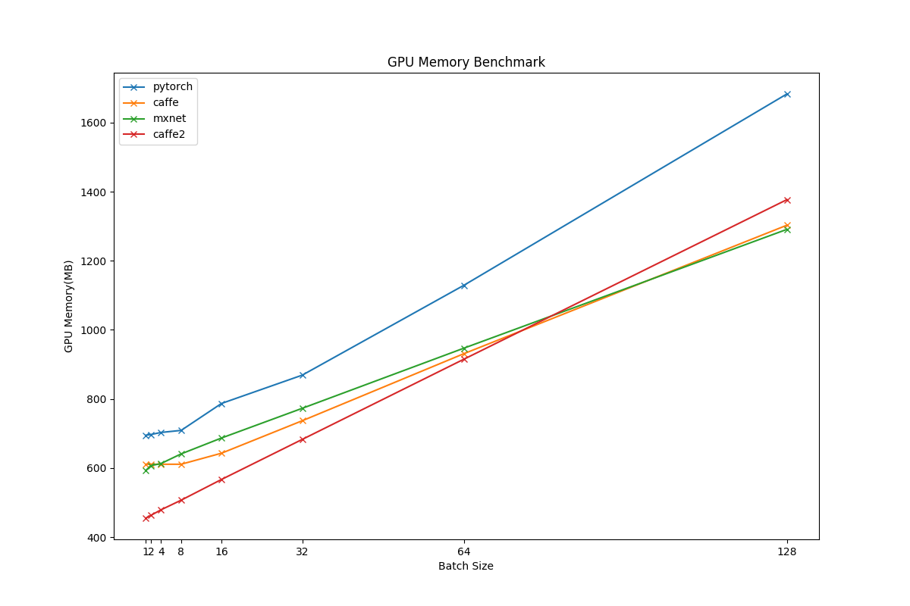
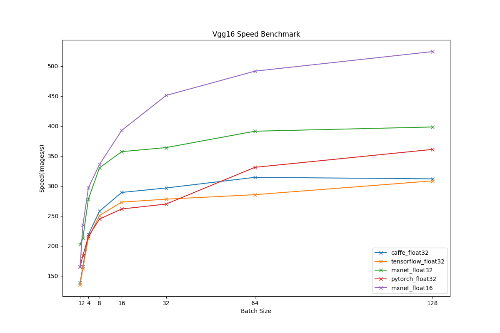
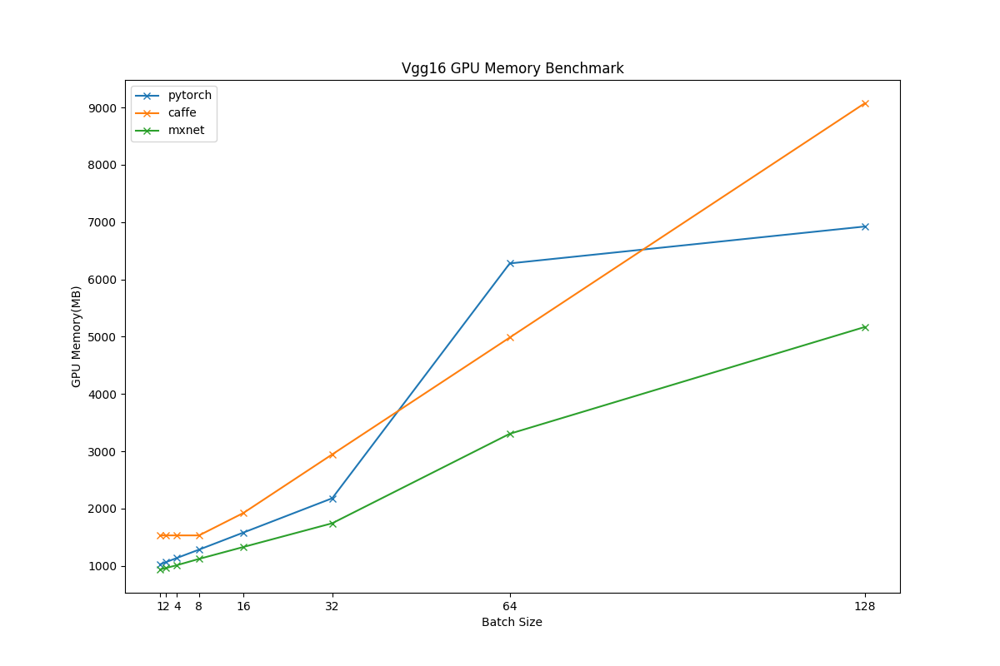
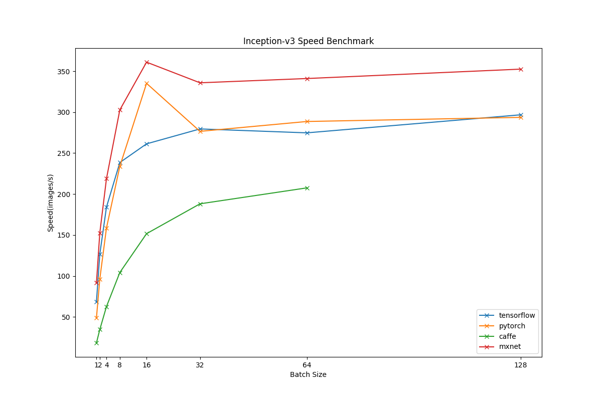
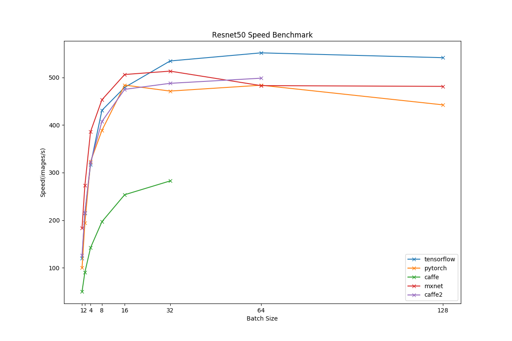
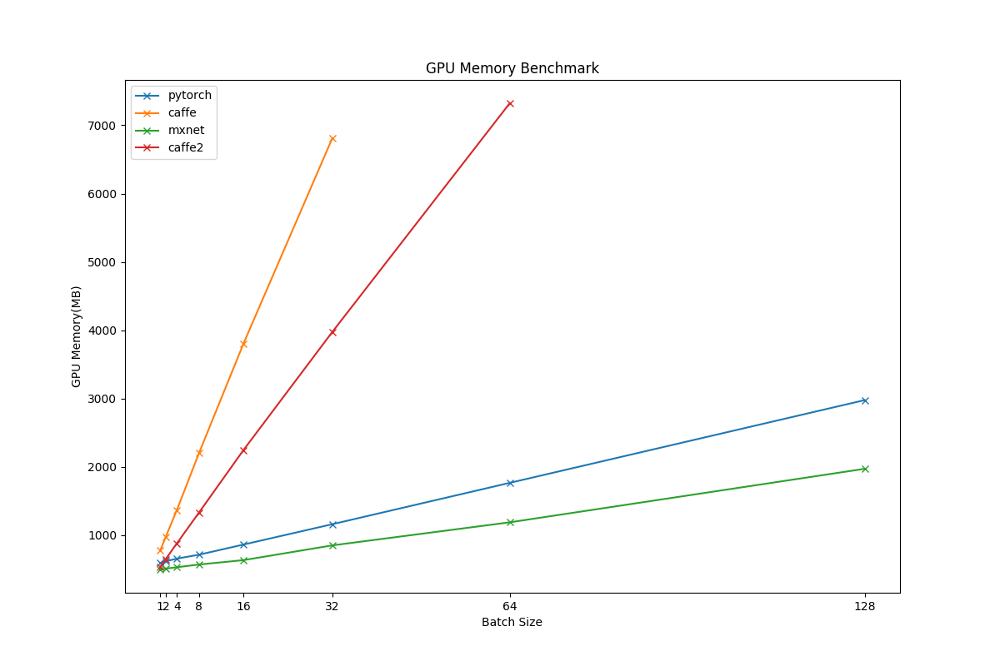
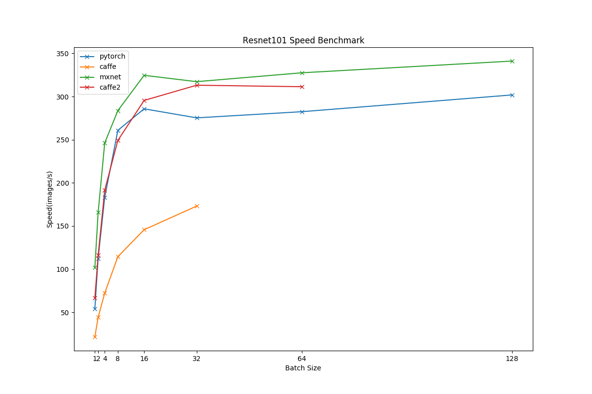
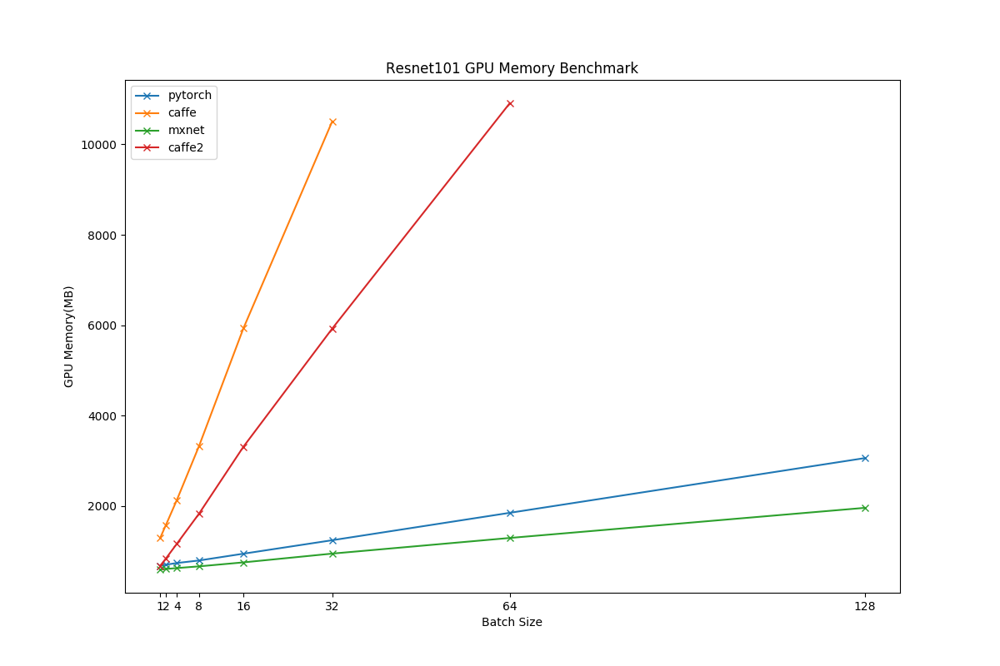
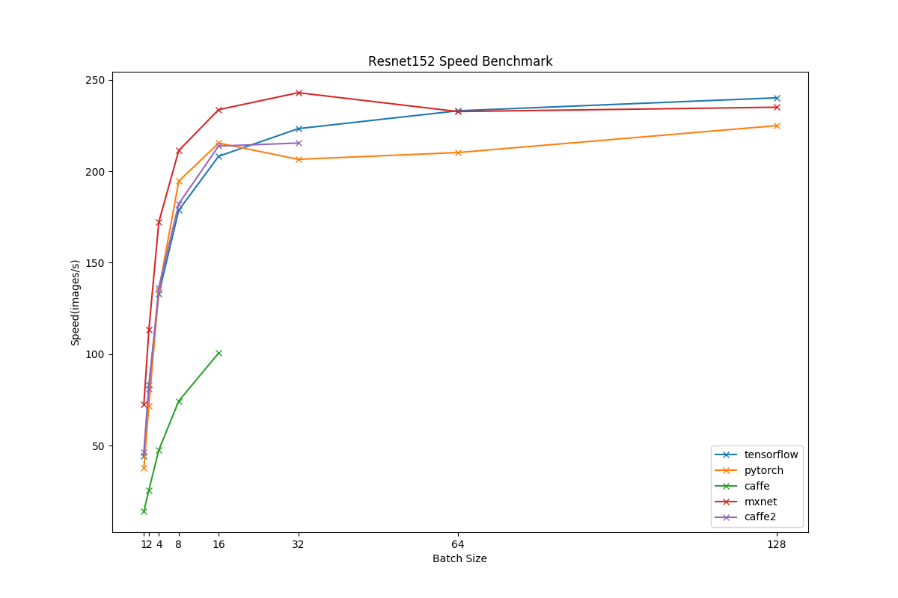

# Benchmark Results of Titan X (Pascal)

* GPU: Titan X (Pascal)
* CPU: Intel(R) Xeon(R) CPU E5-2630 v4 @ 2.20GHz
* OS: Ubuntu 16.04 LTS
* Nvidia Driver: 375.26
* CUDA: 8.0.61
* CUDNN: 5.1.5
* Caffe GitHub hash: [cd88ec9](https://github.com/BVLC/caffe/commit/7d3f8a7ea43fb06cd9804bc90933c7a91cd88ec9)
* Caffe2 GitHub hash: [df75c7f](https://github.com/caffe2/caffe2/commit/dd4cad03c5ad812c32d2b90f6a64c516edf75c7f)
* MXNet GitHub hash: [5a7aa20](https://github.com/dmlc/mxnet/commit/5efd91a71f36fea483e882b0358c8d46b5a7aa20)
* PyTorch version: 0.1.12_2
* Tensorflow version: 1.0.1

## AlexNet

## VGG16

## VGG19

## Inception-V3

## ResNet50

## ResNet101

## ResNet152

